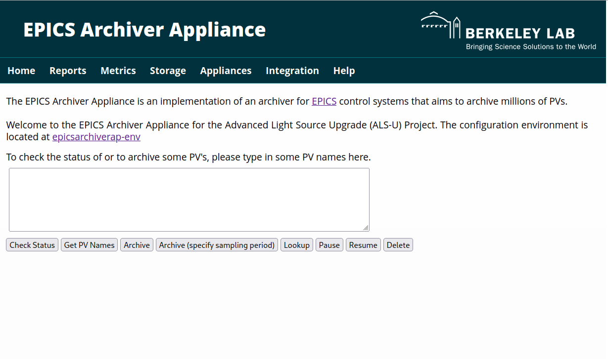

# WIP - EPICS Archiver Appliance Configuration Environment with MAVEN

This repository provides the Configuration Environment for the [EPICS Archiver Appliance with MAVEN](https://github.com/jeonghanlee/epicsarchiverap-maven) project, specifically tailored for [the Advanced Light Source Upgrade (ALS-U) Project](https://als.lbl.gov/als-u/overview/) at [Lawrence Berkeley National Laboratory](https://lbl.gov).

The source code for the [EPICS Archiver Appliance with MAVEN](https://github.com/jeonghanlee/epicsarchiverap-maven) build **IS** fundamentally based on the community version. However, its building method **IS NOT** the same as the standard community version. While the goal is to maintain minimal code differences from the community release, some variations may be present. The primary distinction is the use of **MAVEN** as the core build environment for that project, though **ANT** is also currently utilized for certain auxiliary tasks. For a more detailed understanding of the build system and specific modifications in that version, please refer to the [EPICS Archiver Appliance with MAVEN](https://github.com/jeonghanlee/epicsarchiverap-maven) repository.

**Not fully working - Work In Progress**

## Debian 12

This guide outlines the setup process on a Debian 12 system.

### Pre-requirement packages

These commands initialize the environment and install essential software packages required for the Archiver Appliance and its dependencies.

```bash
make init
scripts/required_pkgs.sh
```

### MariaDB

This section covers the setup and configuration of the MariaDB database, which will store the archived data and appliance configuration.

```bash
# Start MariaDB service and check its status
sudo systemctl start mariadb
sudo systemctl status mariadb
```

The following make targets automate common database administration tasks:
```
make db.secure
make db.addAdmin
make db.show
make db.create
make db.show
make sql.fill
make sql.show
```

### Tomcat 9

Apache Tomcat 9 is utilized in this environment primarily for its **templating capabilities and to provide an execution path for specific application components or scripts**, rather than being run as a continuous service container for web applications.

```
# Set or display Tomcat-specific variables used in the build process
make vars FILTER=TOMCAT

# Download the specified version of Tomcat 9
make tomcat.get

# Install Tomcat 9 to the designated location, making its libraries and tools available
make tomcat.install

# Verify that Tomcat has been installed correctly and its components are accessible
make tomcat.exist
```

### Build, install, and Service

These commands compile the Archiver Appliance source code, install it, and manage its system service.

```
# Compile the EPICS Archiver Appliance source code
make build

# Install the compiled application and necessary files
make install

# Check if the application components exist in their installed locations
make exist

# Start the Archiver Appliance service (likely a systemd service)
make sd_start

# Check the current status of the Archiver Appliance service
make sd_status
```

### Home Screenshot

||
| :---: |
|**Figure 1** Archiver Appliance Home Screen|


### Switch between different source commits

First, update `SRC_TAG` in `configure/RELEASE` to the desired Git commit hash, tag, or branch name. Then run:

```bash
make srcupdate
```

