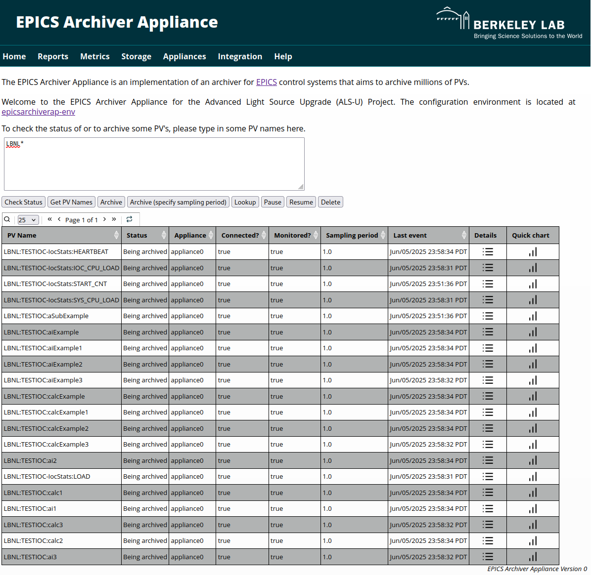

# EPICS Archiver Appliance Configuration Environment with MAVEN
This repository provides the Configuration Environment for the [EPICS Archiver Appliance with MAVEN](https://github.com/jeonghanlee/epicsarchiverap-maven) project.

The source code for the [EPICS Archiver Appliance with MAVEN](https://github.com/jeonghanlee/epicsarchiverap-maven) build **IS** fundamentally based on the community version. However, its building method **IS NOT** the same as the community version. While the goal is to maintain minimal code differences from the community release, some variations may be present. The primary distinction is the use of **MAVEN** as the core build environment for that project, though **ANT** is also currently utilized for certain auxiliary tasks. For a more detailed understanding of the build system and specific modifications in that version, please refer to the [EPICS Archiver Appliance with MAVEN](https://github.com/jeonghanlee/epicsarchiverap-maven) repository.

**Project Status**: Implementation status and observed verification results are recorded in the [work register](docs/milestone-265f580.md).

## Scope

This document covers setup and build of the EPICS Archiver Appliance with MAVEN on Debian 13: prerequisites, MariaDB configuration, the four Tomcat 9 runtime instances, and systemd service management.

**Out of scope:**
* Archiving policy configuration and storage tier tuning — see [docs/README.policies.md](docs/README.policies.md).
* Data lifecycle and ETL behavior over time — see [docs/README.DataJourney.md](docs/README.DataJourney.md).
* The upstream community build process — see [archiver-appliance/epicsarchiverap](https://github.com/archiver-appliance/epicsarchiverap).

## Purpose of this Environment
This repository provides a set of `Makefiles` and scripts to automate the setup and build process for the EPICS Archiver Appliance with MAVEN. It handles system dependencies, database configuration, and service management to create a reproducible environment currently on Debian 13.

## Prerequisites
* **JDK 21+**: the distro package (`openjdk-21-jdk-headless` on Debian 13), installed by the package step below.
* **Apache Maven**: none to install. The source repository ships the Maven Wrapper (`./mvnw`), which downloads its pinned Maven version on the first build.
* **Git**: Required for generating release notes from commit history (this is part of the documentation generation process).
* **Operating System**:
    * Core build (JARs/WARs) is generally OS-agnostic.
    * Sphinx documentation (`build_docs.sh`) is primarily for Linux.
* **Sphinx Tools**: nothing to install by hand. The package step provides Python and `python3-venv`, and the documentation build (`build_docs.sh`) bootstraps Sphinx into its own venv on the first run.

## Debian 13 Setup Guide
This guide outlines the setup and build process on a Debian 13 system.

### Pre-requirement packages
Install the OS packages from the per-OS list in `configure/os/` (one package per line), then check out the source.

```bash
sudo bash scripts/install_os_packages.bash
make init
```
### MariaDB
MariaDB stores appliance configuration, including archive requests, PV type information, aliases, and external data server definitions. Archived samples are stored in `.pb` files in the STS, MTS, and LTS directories, not in MariaDB.

```bash
# Start MariaDB service and check its status
sudo systemctl start mariadb
sudo systemctl status mariadb
```

The following make targets automate common database administration tasks:
```bash
make db.secure
make db.addAdmin
make db.show
make db.create
make db.show
make sql.fill
make sql.show
```

### Tomcat 9
Apache Tomcat 9.0.121 hosts the four WARs in separate `mgmt`, `engine`, `etl`, and `retrieval` instances. They share `CATALINA_HOME` and have separate `CATALINA_BASE` directories. The `epicsarchiverap-maven.service` unit runs `archappl.bash`, which starts and stops these instances in their required order. The separate generic Tomcat service is not required.

```bash
# Set or display Tomcat-specific variables used in the build process
make vars FILTER=TOMCAT

# Download the specified version of Tomcat 9
make tomcat.get

# Install the shared Tomcat runtime
make tomcat.install

# Verify that Tomcat has been installed correctly and its components are accessible
make tomcat.exist
```

### Build, install, and Service
With the environment and dependencies in place, these commands compile the Archiver Appliance source code, install it to the target directories, and manage the systemd service.

```bash
# Compile the EPICS Archiver Appliance source code
make build

# Install the compiled application and necessary files
make install

# Check if the application components exist in their installed locations
make exist

# Start the Archiver Appliance systemd service
make sd_start

# Check the current status of the Archiver Appliance service
make sd_status
```

### Home Screenshot


*Figure 1 — Archiver Appliance Home Screen*

### Switch between different source commits
To build against a different version of the source code:

* First, update the `SRC_TAG` variable in the `configure/RELEASE` file to the desired Git commit hash, tag, or branch name.
* Then, run the following command to update the source code checkout:

```bash
make srcupdate
```
