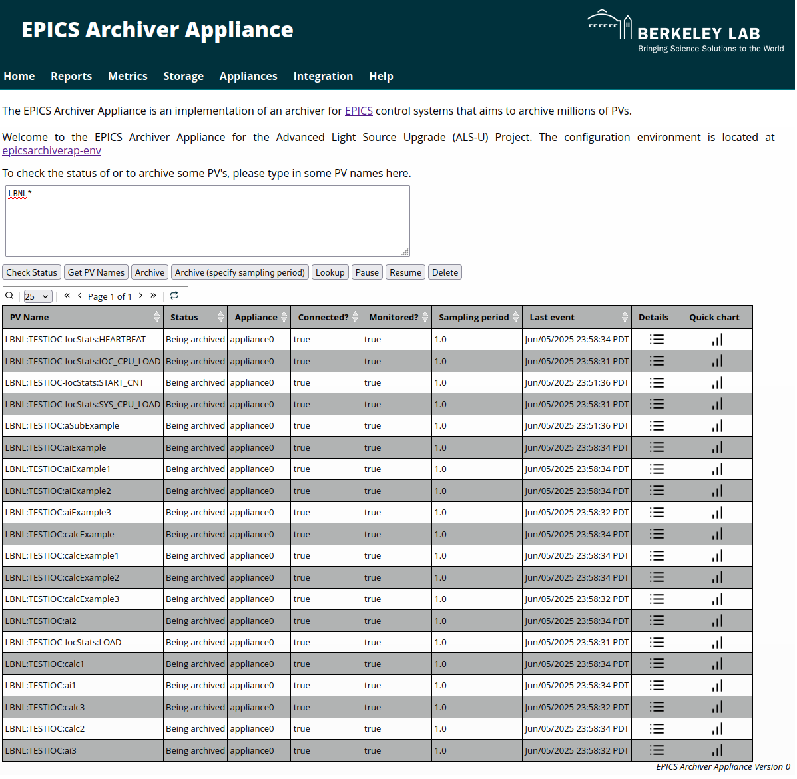

# EPICS Archiver Appliance Configuration Environment with MAVEN
This repository provides the Configuration Environment for the [EPICS Archiver Appliance with MAVEN](https://github.com/jeonghanlee/epicsarchiverap-maven) project.

The source code for the [EPICS Archiver Appliance with MAVEN](https://github.com/jeonghanlee/epicsarchiverap-maven) build **IS** fundamentally based on the community version. However, its building method **IS NOT** the same as the community version. While the goal is to maintain minimal code differences from the community release, some variations may be present. The primary distinction is the use of **MAVEN** as the core build environment for that project. For a more detailed understanding of the build system and specific modifications in that version, please refer to the [EPICS Archiver Appliance with MAVEN](https://github.com/jeonghanlee/epicsarchiverap-maven) repository.

**Project Status**: Implementation status and observed verification results are recorded in the [work register](docs/milestone-2.0.1.md).

## Scope

This document covers local installation of the EPICS Archiver Appliance with MAVEN on Debian 13, Rocky Linux 8, Rocky Linux 10.2, Ubuntu 24.04 LTS or Ubuntu 26.04 LTS using SQLite or MariaDB. It also covers the manual Debian 13 setup, the four Tomcat 9 runtime instances, and systemd service management.

**Out of scope:**
* Archiving policy configuration and storage tier tuning — see [docs/README.policies.md](docs/README.policies.md).
* Data lifecycle and ETL behavior over time — see [docs/README.DataJourney.md](docs/README.DataJourney.md).
* The upstream community build process — see [archiver-appliance/epicsarchiverap](https://github.com/archiver-appliance/epicsarchiverap).

## Purpose of this Environment
This repository provides a set of `Makefiles` and scripts to automate the setup and build process for the EPICS Archiver Appliance with MAVEN. It handles system dependencies, database configuration, and service management on Debian 13, Rocky Linux 8, Rocky Linux 10.2, Ubuntu 24.04 LTS and Ubuntu 26.04 LTS.

## Prerequisites
* **JDK 21**: required by the local installation scripts. The package step installs `openjdk-21-jdk-headless` on Debian 13 or Ubuntu 24.04/26.04, and `java-21-openjdk-devel` on Rocky Linux 8 or 10.2.
* **Apache Maven**: none to install. The source repository ships the Maven Wrapper (`./mvnw`), which downloads its pinned Maven version on the first build.
* **Git**: Required to clone and select the pinned application source.
* **Operating System**:
    * Core build (JARs/WARs) is generally OS-agnostic.

## Local systemd installation

The [local installation procedure](docs/README.install.md#local-systemd-installation)
provides three entry scripts: `scripts/install-local-sqlite.bash`,
`scripts/install-local-mariadb-uds.bash`, and
`scripts/install-local-mariadb-tcp.bash`. Run the selected script as the ordinary
checkout owner; it uses `sudo` for privileged steps. Each supports `--plan`.

These scripts install packages, select the configured source pin, build the
appliance, prepare its database, replace its payload, and start its systemd
service and health timer. MariaDB account preparation also sets configured
passwords and grants on existing accounts; use `--existing-db` to preserve
provisioned accounts. Follow the linked procedure before confirming installation.

The [script reference](scripts/README.md) lists all 13 Bash files, the five
supported OS defaults, and the optional soft IOC verification contract.
Startup verification checks four JVMs, storage usage, component startup states,
and appliance information. PV acquisition and retrieval require the separate
optional test. The default UI URL is `http://localhost:17665/mgmt/ui/index.html`.

## Debian 13 Setup Guide
This guide outlines the setup and build process on a Debian 13 system.

### Pre-requirement packages
Install the OS packages from the per-OS list in `configure/os/` (one package per line), then check out the source.

```bash
sudo bash scripts/install_os_packages.bash
make debian13.conf
make init
```
### MariaDB
MariaDB stores appliance configuration, including archive requests, PV type information, aliases, and external data server definitions. Archived samples are stored in `.pb` files in the STS, MTS, and LTS directories, not in MariaDB.

```bash
# Start MariaDB service and check its status
sudo systemctl start mariadb
sudo systemctl status mariadb
```

For this manual local setup, set credentials and `DB_SOCKET` in
`../CONFIG_SITE.local` as described in the
[configuration guide](docs/README.install.md#configuration-variable-placement).
Socket clients match the administrator account created at `localhost`.
For TCP provisioning, use the TCP installation entry script instead.
Create the database and account:

```bash
make db.conf
make db.addAdmin
make db.create
```

### Tomcat 9
Apache Tomcat 9.0.121 hosts the four WARs in separate `mgmt`, `engine`, `etl`, and `retrieval` instances. They share `CATALINA_HOME` and have separate `CATALINA_BASE` directories. The `epicsarchiverap-maven.service` unit runs `archappl.bash`, which starts and stops these instances in their required order. The separate generic Tomcat service is not required.

```bash
# Set or display Tomcat-specific variables used in the build process
make vars FILTER=TOMCAT

# Download the specified version of Tomcat 9
make tomcat.get

# Install the shared Tomcat runtime
make tomcat.install

# Verify that Tomcat has been installed correctly and its components are accessible
make tomcat.exist
```

### Build, install, and verify

Follow the [ordered install sequence](docs/README.install.md#ordered-sequence) after the host prerequisites and database setup above. Generate the configuration, build the four WARs, and load the MariaDB schema as the build user:

```bash
make db.conf
make conf.archapplproperties
make build.mvn
make sql.fill
make sql.show
```

Then run storage preparation, installation, and startup as root, in that order. The [ordered sequence](docs/README.install.md#ordered-sequence) identifies each privileged target and its expected result. Do not use the combined `make build` target because it also performs privileged storage preparation.

For an existing installation, follow the [reinstall procedure](docs/README.install.md#reinstall-and-upgrade), including the appliance stop before replacement. Complete the install guide's [verification checks](docs/README.install.md#health-check) to confirm process health and application operation.

### Home Screenshot


*Figure 1 — Archiver Appliance Home Screen*

### Switch between different source commits
To build against a different version of the source code:

* First, set `SRC_TAG` in `configure/RELEASE.local` or `../RELEASE.local` to
  the desired Git commit hash, tag, or branch name. Keep the tracked release
  defaults in `configure/RELEASE` unchanged.
* Then, run the following command to update the source code checkout:

```bash
make srcupdate
```
