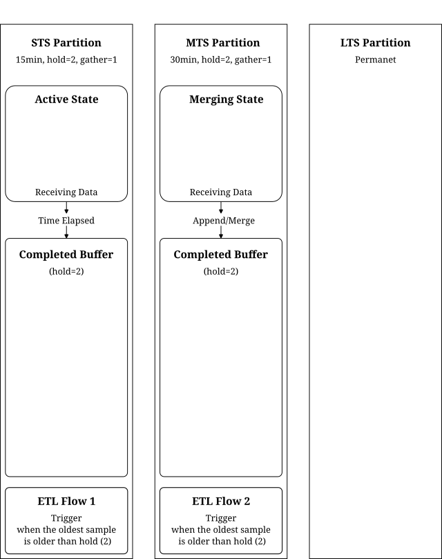
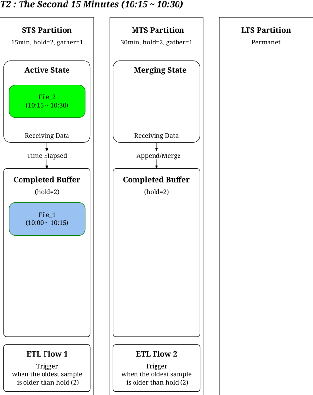
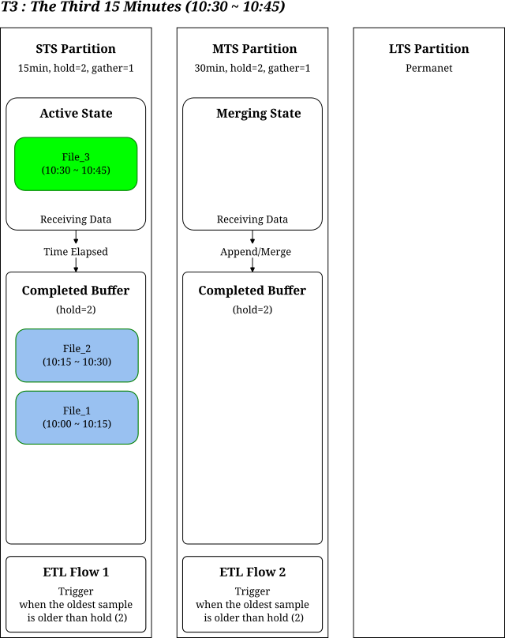
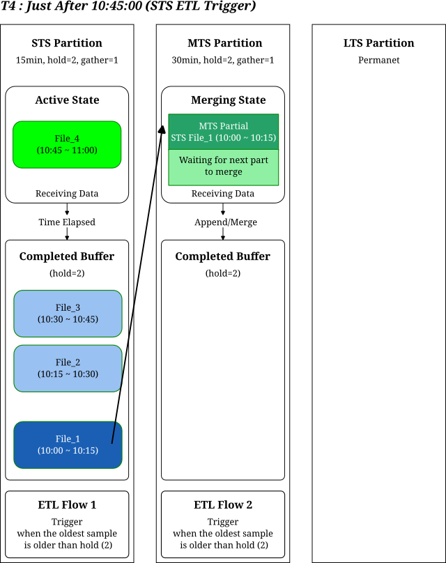
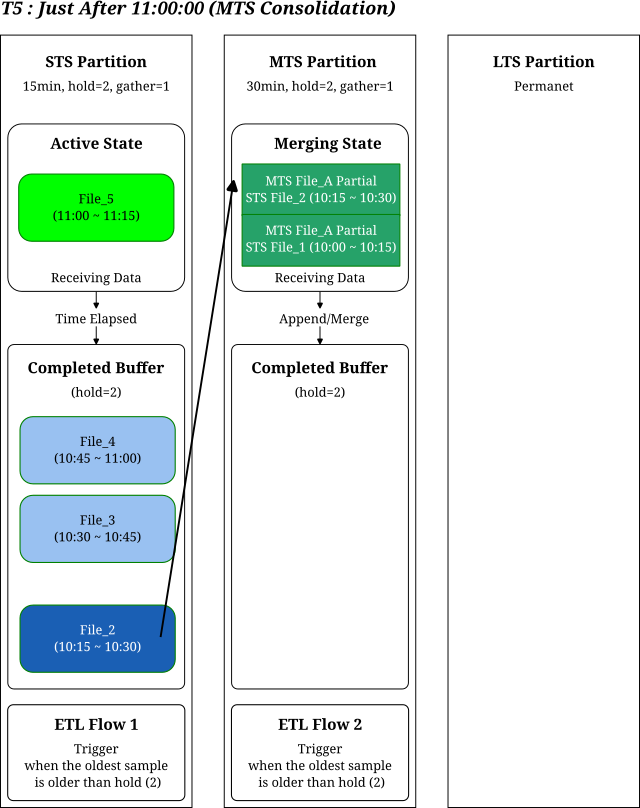
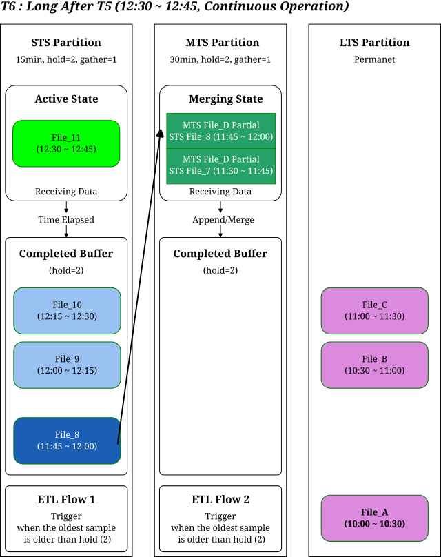

# The Data Journey in the EPICS Archiver Appliance

**Author:** Sangil Lee & Jeong Han Lee

This document outlines the storage hierarchy and ETL logic of the Archiver Appliance, incorporating a timestamped scenario to illustrate how data moves over time.

## Executive Summary

The Archiver Appliance utilizes a three-tiered storage strategy to balance high-speed data acquisition with long-term capacity management. Data flows from high-speed Short Term Storage (STS), is consolidated into larger files in Middle Term Storage (MTS), and finally rests in permanent Long Term Storage (LTS).

The crucial logic determining **when and how much data to move** between these tiers is defined by the ETL rules: `hold` and `gather`.

## 1. Storage Tiers and File Units

Data moves through the following stages:

1.  **STS (Short Term Storage):**
    * Role: Designed for high-frequency writes, typically on fast media like RAMDisks or SSDs. Files here are temporary and meant for ETL migration.
    * File Unit: In this scenario, we use a `PARTITION_15MIN` granularity, meaning each `.pb` file holds 15 minutes of data.
2.  **MTS (Middle Term Storage):**
    * Role: An intermediate staging area that consolidates smaller files from STS into larger units. Data here is also temporary.
    * File Unit: Here, we use `PARTITION_30MIN`, consolidating two 15-minute files from STS into one 30-minute file.
3.  **LTS (Long Term Storage):**
    * Role: The final destination for the permanent archiving of historical data.

### Two Critical File States

Data files exist in one of two states based on time:

* **Active State:** The file is currently being written to, and its defined time duration has not yet elapsed.
* **Completed State:** The time duration has passed, and the file is closed. ETL movement rules (`hold`) apply ONLY to these 'Completed' files.

## 2. Data Movement Rules: ETL Flow Control

The rules for moving data between tiers are dictated by the `hold` and `gather` parameters. This explanation uses the recommended configuration of `hold=2` and `gather=1`.

The central logic guiding the movement is:

**Core Rule: "When the number of completed files exceeds the `hold` value (`Count > Hold`), initiate a move of the oldest files amounting to the `gather` count."**

* `hold=2` (Buffer Size): The ETL process waits until there are more than 2 (i.e., 3 or more) completed files in the current tier's buffer before acting.
* `gather=1` (Batch Move Size): Once the trigger condition above is met, the single oldest file is selected to be moved to the next tier.
* *Constraint:* The `hold` value must always be greater than the `gather` value.

## 3. Timeline Scenario: A Day in the Life of Data

Let's trace the journey of data with a concrete timeline to visualize the flow.

**Scenario Settings:**
* Start Time: 10:00:00 AM
* STS Partition: 15 minutes
* MTS Partition: 30 minutes
* ETL Rule: `hold=2`, `gather=1`

### [T1] 10:00:00 - 10:15:00 (The First 15 Minutes)
* **STS:** The first file, `File_1 (10:00-10:15)`, is created. Data is actively being written to it (Active State).

||
| :---: |
|**Figure 1** T1, The First 15 Minutes|

### [T2] 10:15:00 - 10:30:00 (The Second 15 Minutes)
* **STS:** `File_1` completes its 15-minute span and moves to the Completed buffer.
    * Completed Buffer Count: 1 (`File_1`).
    * *Action:* No move takes place yet, as the buffer count (1) is not greater than the `hold` value (2).
* **STS:** A new file, `File_2 (10:15-10:30)`, begins writing (Active State).

||
| :---: |
|**Figure 2** T2, The Second 15 Minutes|

### [T3] 10:30:00 - 10:45:00 (The Third 15 Minutes)
* **STS:** `File_2` completes and enters the buffer.
    * Completed Buffer Count: 2 (`File_1`, `File_2`).
    * *Action:* Still no move takes place, as the count (2) is not *greater* than the `hold` value (2).
* **STS:** A new file, `File_3 (10:30-10:45)`, begins writing.

||
| :---: |
|**Figure 3** T3, The Third 15 Minutes|

### [T4] Just After 10:45:00 (ETL Trigger Moment)
* **STS:** `File_3` completes and enters the buffer.
    * Completed Buffer Count: 3 (`File_1`, `File_2`, `File_3`).
    * *Trigger:* The buffer count (3) is now greater than the `hold` value (2), satisfying the condition to move data.
    * *Action:* The ETL process initiates. Based on the `gather=1` setting, the single oldest file, `File_1 (10:00-10:15)`, is moved to MTS.
* **MTS:** `File_1` arrives in MTS. It becomes the first half (Active State) of a new 30-minute partition covering `10:00-10:30`.

||
| :---: |
|**Figure 4** T4, Just After 10:45:00|

### [T5] Just After 11:00:00 (MTS Consolidation)
* **STS:** The cycle continues. A new file completes in STS, triggering the move of the next oldest file, `File_2 (10:15-10:30)`, to MTS.
* **MTS:** `File_2` arrives and is merged/appended with the waiting `File_1`.
* **Result:** A complete 30-minute file for the total period `10:00-10:30` is formed. This new file moves to the MTS Completed buffer, where it will wait for the MTS `hold` trigger before eventually moving to LTS.

||
| :---: |
|**Figure 5** T5, Just After 11:00:00|

### [T6] Long After T5 (Continuous Operation)

After a longer period, the system reaches a steady state where both STS and MTS buffers are full, and data is being continuously moved to LTS as new files are created. This final image illustrates the complete end-to-end data flow.

||
| :---: |
|**Figure 6** T6, Long After T5|

