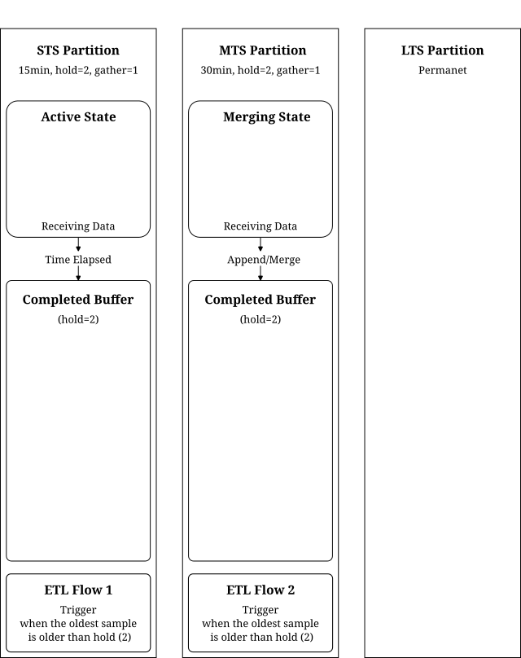
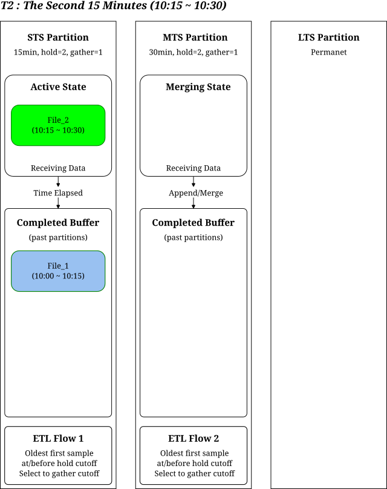
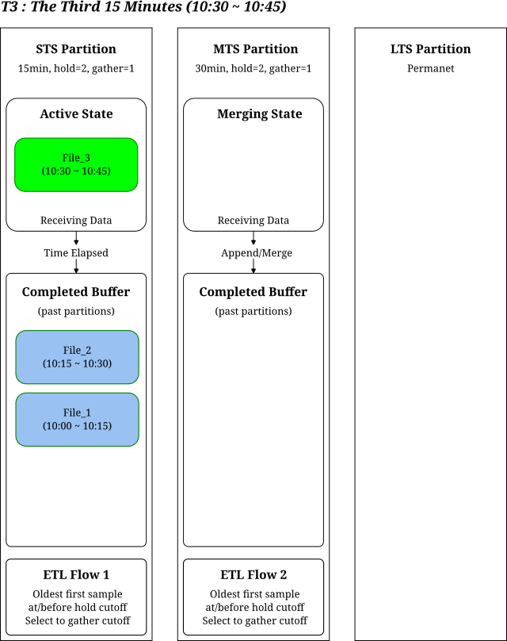
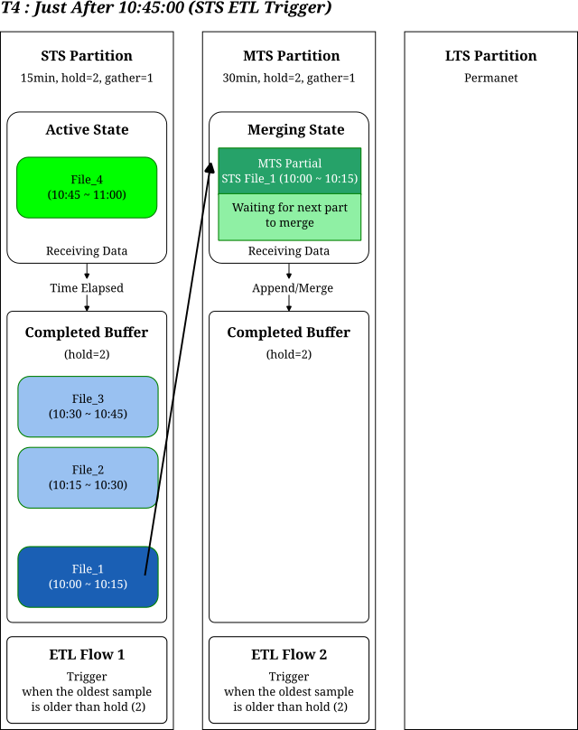
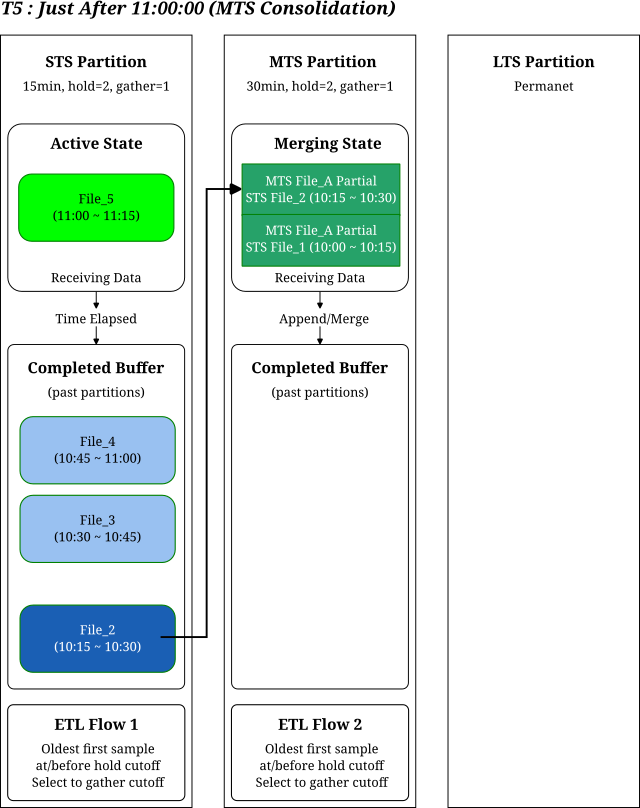
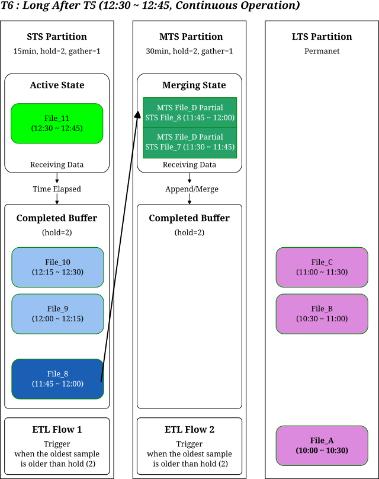

# The Data Journey in the EPICS Archiver Appliance

**Author:** Sangil Lee & Jeong Han Lee

This document outlines the storage hierarchy and ETL logic of the Archiver Appliance, incorporating a timestamped scenario to illustrate how data moves over time.

## Executive Summary

The Archiver Appliance utilizes a three-tiered storage strategy to balance high-speed data acquisition with long-term capacity management. Data flows from high-speed Short Term Storage (STS), is consolidated into larger files in Middle Term Storage (MTS), and finally rests in permanent Long Term Storage (LTS).

The crucial logic determining **when and how much data to move** between these tiers is defined by the ETL rules: `hold` and `gather`.

## 1. Storage Tiers and File Units

Data moves through the following stages:

1.  **STS (Short Term Storage):**
    * Role: Designed for high-frequency writes, typically on fast media like RAMDisks or SSDs. Files here are temporary and meant for ETL migration.
    * File Unit: In this scenario, we use a `PARTITION_15MIN` granularity, meaning each `.pb` file holds 15 minutes of data.
2.  **MTS (Middle Term Storage):**
    * Role: An intermediate staging area that consolidates smaller files from STS into larger units. Data here is also temporary.
    * File Unit: Here, we use `PARTITION_30MIN`, consolidating two 15-minute files from STS into one 30-minute file.
3.  **LTS (Long Term Storage):**
    * Role: The final destination for the permanent archiving of historical data.

### Two Critical File States

Data files exist in one of two states based on time:

* **Active State:** The file is currently being written to, and its defined time duration has not yet elapsed.
* **Completed State:** The time duration has passed, and the file is closed. ETL movement rules (`hold`) apply ONLY to these 'Completed' files.

## 2. Data Movement Rules: ETL Flow Control

The rules for moving data between tiers are dictated by the `hold` and `gather` parameters. This explanation uses the recommended configuration of `hold=2` and `gather=1`.

ETL uses time boundaries derived from the evaluation time and the tier's partition duration.

* `hold`: Subtract `hold` times the approximate partition duration from the evaluation time, then take the last second of the preceding partition. The oldest candidate file must have its first sample at or before this boundary.
* `gather`: Compute a second boundary in the same way using `hold - (gather - 1)` partition durations. Select files whose first samples are at or before that boundary. With `hold=2` and `gather=1`, both boundaries are the same.
* A delayed ETL run can select several files even with `gather=1`. Missing partitions do not postpone eligibility; the age of the available data determines when it can move.
* Use nonnegative values with `hold >= gather`; equality is allowed. Both values default to zero, which skips these boundaries and takes the available candidates before the current partition.

See [ETL flow control](README.policies.md#23-etl-flow-control) for the policy parameter reference.

## 3. Timeline Scenario: A Day in the Life of Data

Let's trace the journey of data with a concrete timeline to visualize the flow.

**Scenario Settings:**
* Start Time: 10:00:00 AM
* STS Partition: 15 minutes
* MTS Partition: 30 minutes
* ETL Rule: `hold=2`, `gather=1`

All times are UTC. The example assumes continuous samples from 10:00 and ETL evaluations at the times shown. File counts describe the displayed state; the time boundaries determine eligibility.

### [T1] 10:00:00 - 10:15:00 (The First 15 Minutes)
* **STS:** The first file, `File_1 (10:00-10:15)`, is created. Data is actively being written to it (Active State).

||
| :---: |
|**Figure 1** T1, The First 15 Minutes|

### [T2] 10:15:00 - 10:30:00 (The Second 15 Minutes)
* **STS:** `File_1` completes its 15-minute span and moves to the Completed buffer.
    * Completed Buffer Count: 1 (`File_1`).
    * *Action:* At 10:15, the STS boundary is 09:44:59. `File_1` starts at 10:00, so it is not yet eligible.
* **STS:** A new file, `File_2 (10:15-10:30)`, begins writing (Active State).

||
| :---: |
|**Figure 2** T2, The Second 15 Minutes|

### [T3] 10:30:00 - 10:45:00 (The Third 15 Minutes)
* **STS:** `File_2` completes and enters the buffer.
    * Completed Buffer Count: 2 (`File_1`, `File_2`).
    * *Action:* At 10:30, the STS boundary is 09:59:59. `File_1` starts at 10:00, so it is still not eligible.
* **STS:** A new file, `File_3 (10:30-10:45)`, begins writing.

||
| :---: |
|**Figure 3** T3, The Third 15 Minutes|

### [T4] Just After 10:45:00 (ETL Trigger Moment)
* **STS:** `File_3` completes and enters the buffer.
    * Completed Buffer Count: 3 (`File_1`, `File_2`, `File_3`).
    * *Trigger:* At 10:45, the STS boundary is 10:14:59. The first sample in `File_1` is at or before it.
    * *Action:* `File_1 (10:00-10:15)` is moved to MTS. `File_2` starts at 10:15 and remains in STS.
* **MTS:** `File_1` arrives in MTS. It becomes the first half (Active State) of a new 30-minute partition covering `10:00-10:30`.

||
| :---: |
|**Figure 4** T4, Just After 10:45:00|

### [T5] Just After 11:00:00 (MTS Consolidation)
* **STS:** At 11:00, the STS boundary advances to 10:29:59, making `File_2 (10:15-10:30)` eligible to move to MTS.
* **MTS:** `File_2` arrives and is merged/appended with the waiting `File_1`.
* **Result:** A complete 30-minute file for the total period `10:00-10:30` is formed. At 11:00, the MTS boundary is 09:59:59, so its first sample at 10:00 is not yet eligible to move to LTS.

||
| :---: |
|**Figure 5** T5, Just After 11:00:00|

### [T6] Long After T5 (Continuous Operation)

After a longer period, the system reaches a steady state: STS keeps completing files and handing the oldest one to MTS, MTS keeps assembling them, and data that has aged past the MTS `hold` boundary keeps moving on to LTS. This final image illustrates the complete end-to-end data flow.

* **STS:** `File_11 (12:30-12:45)` is receiving data, while `File_10`, `File_9` and `File_8` wait in the Completed buffer. `File_8 (11:45-12:00)` is the one ETL is moving out.
* **MTS:** `File_D` is being assembled from the arriving `File_7` and `File_8`. Its Completed buffer is empty.
* **LTS:** `File_C (11:00-11:30)`, `File_B (10:30-11:00)` and `File_A (10:00-10:30)` now sit in permanent storage. At this 12:30 evaluation the MTS `hold` of 2 over a 30-minute partition puts the boundary at 11:29:59, and any file whose first sample is at or before it has already left MTS. `File_B` and `File_C` both qualify, which is why the MTS Completed buffer is empty.

||
| :---: |
|**Figure 6** T6, Long After T5|

