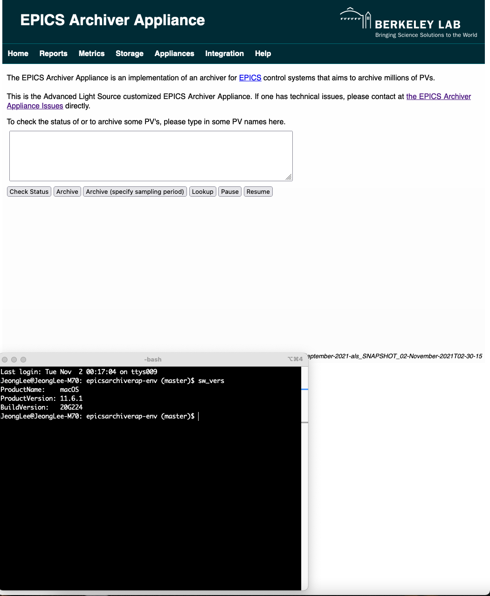

# Archiver Appliance for ONLY macOS 11.6.1

This is the macOS 11.6.1 specific installation guide.  

## Init

```bash
$ make init
```

## Packages, and MariaDB, and Tomcat

The default **port** package management shall be used. 

```bash
$ make install.pkgs
```

### Configure MariaDB

```bash
$ sudo port unload mariadb-10.5-server
$ sudo vi /opt/local/etc/mariadb-10.5/my.cnf
# Use default MacPorts settings
!include /opt/local/etc/mariadb-10.5/macports-default.cnf
[mariadb]
skip-networking = 0
bind-address = 127.0.0.1
port = 3306
$ sudo port load mariadb-10.5-server
$ netstat -an |grep LISTEN
$ nmap -sT -sV localhost -p 3306
```

### Update DB for Archiver Appliance

```bash
$ make db.secure
$ make db.addAdmin
$ make db.show
$ make db.create
$ make db.show
$ make sql.fill
$ make sql.show
#
$ make macos.conf
$ make tomcat.action
$ make tomcat.exit
```

## Build and Install 

```bash
$ make build
$ make src_install
$ make services.install
$ make exist
```

## Run, status, and stop

```bash
bash /opt/epicsarchiverap/archappl.bash startup
bash /opt/epicsarchiverap/archappl.bash status
bash /opt/epicaarchiverap/archappl.bash stop
```

||
| :---: |
|**Figure 1** Archiver Appliance Home Page Screenshot on macOS.|


## Warning

Please change the default user account and its password for MariaDB, and so on.
